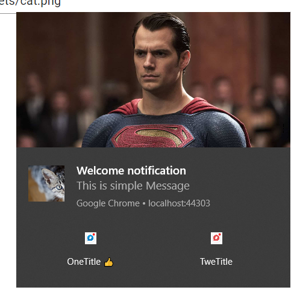

# Create push notification
```js
(function () {
    // Note: Replace with your own key pair before deploying
    const applicationServerPublicKey = 'BLPLA4GcvI0Yn9lkY1KlIyLwsjZGjQIuiCq03UhqfumEh4U4bziXReGbY2C9kEbcGnxogQ8KIWalqUAs38LTZPQ';
    window.blazoring = {
        requestSubscription: async () => {
            const worker = await navigator.serviceWorker.getRegistration();
            const existingSubscription = await worker.pushManager.getSubscription();
            if (!existingSubscription) {
                const newSubscription = await subscribe(worker);
                if (newSubscription) {
                    return {
                        url: newSubscription.endpoint,
                        p256dh: arrayBufferToBase64(newSubscription.getKey('p256dh')),
                        auth: arrayBufferToBase64(newSubscription.getKey('auth'))
                    };
                }
            }
            else {
                return {
                    url: existingSubscription.endpoint,
                    p256dh: arrayBufferToBase64(existingSubscription.getKey('p256dh')),
                    auth: arrayBufferToBase64(existingSubscription.getKey('auth'))
                };
            }
        }
    };

    async function subscribe(worker) {
        try {
            return await worker.pushManager.subscribe({
                userVisibleOnly: true,
                applicationServerKey: applicationServerPublicKey
            });
        } catch (error) {
            if (error.name === 'NotAllowedError') {
                return null;
            }
            throw error;
        }
    }

    function arrayBufferToBase64(buffer) {
        // https://stackoverflow.com/a/9458996
        var binary = '';
        var bytes = new Uint8Array(buffer);
        var len = bytes.byteLength;
        for (var i = 0; i < len; i++) {
            binary += String.fromCharCode(bytes[i]);
        }
        return window.btoa(binary);
    }
})();
```
Add reference in index.html
```js
<script src="js/pushNotification.js"></script>
```

In MainLayout set registration of PushNotication

```cs
  protected override async Task OnAfterRenderAsync(bool firstRender)
  {
      await base.OnAfterRenderAsync(firstRender);
      if(firstRender)
          await RequestNotificationSubscriptionAsync();
  }
```

```cs
#region [Push]
private async Task RequestNotificationSubscriptionAsync()
{
    var subscription = await JSRuntime.InvokeAsync<NotificationSubscription>("blazoring.requestSubscription");
    if (subscription != null)
    {
        await SubscribeToNotifications(subscription);
    }
}

public async Task SubscribeToNotifications(NotificationSubscription subscription)
{
    var response = await client.PostAsJsonAsync("NotificationSubscribe", subscription);
    response.EnsureSuccessStatusCode();
}
#endregion
```

# Add Push Notification
```html
@page "/notifications"

<Heading Size="HeadingSize.Is3">Notifications</Heading>

    <Field>
        <TextEdit @bind-Text="@Title" Placeholder="@nameof(Title)"></TextEdit>
    </Field>
    <Field>
        <MemoEdit @bind-Text="@Message" Placeholder="@nameof(Message)" Rows="5"></MemoEdit>
    </Field>

<Fields>
    <Field>
        <TextEdit @bind-Text="@ActionOne.action" Placeholder="@nameof(ActionOne.action)"></TextEdit>
    </Field>
    <Field>
        <TextEdit @bind-Text="@ActionOne.title" Placeholder="@nameof(ActionOne.title)"></TextEdit>
    </Field>
    <Field>
        <TextEdit @bind-Text="@ActionOne.icon" Placeholder="@nameof(ActionOne.icon)"></TextEdit>
    </Field>
</Fields>
<Fields>
    <Field>
        <TextEdit @bind-Text="@ActionTwo.action" Placeholder="@nameof(ActionTwo.action)"></TextEdit>
    </Field>
    <Field>
        <TextEdit @bind-Text="@ActionTwo.title" Placeholder="@nameof(ActionTwo.title)"></TextEdit>
    </Field>
    <Field>
        <TextEdit @bind-Text="@ActionTwo.icon" Placeholder="@nameof(ActionTwo.icon)"></TextEdit>
    </Field>
</Fields>

<Fields>
    <Field>
        <TextEdit @bind-Text="@Badge" Placeholder="@nameof(Badge)"></TextEdit>
    </Field>
    <Field>
        <TextEdit @bind-Text="@Image" Placeholder="@nameof(Image)"></TextEdit>
    </Field>
    <Field>
        <TextEdit @bind-Text="@Icon" Placeholder="@nameof(Icon)"></TextEdit>
    </Field>
</Fields>

<Row>
    <Column ColumnSize="ColumnSize.IsHalf">
        <Button Clicked="AddNotification"><Image Name="add_alert"></Image> Normal </Button>
    </Column>
    <Column ColumnSize="ColumnSize.IsHalf">
        <Button Clicked="AddNotificationWithImage"><Image Name="add_alert"></Image>With Image</Button>
    </Column>
</Row>

@code
{
    [Inject]
    public HttpClient Client { get; set; }

    private string Title { get; set; } = "Welcome notification";
    private string Message { get; set; } = "This is simple Message";
    private string Badge { get; set; } = "assets/beagle.jpg";
    private string Image { get; set; } = "assets/Superman.jpg";
    private string Icon { get; set; } = "assets/cat.png";

    public NotifationAction ActionOne { get; set; } = new NotifationAction();
    public NotifationAction ActionTwo { get; set; } = new NotifationAction();

    protected override void OnInitialized()
    {
        ActionOne = new NotifationAction()
        {
            action = "One",
            title = "OneTitle 👍",
            icon = "assets/action-one/icon.png"
        };

        ActionTwo = new NotifationAction()
        {
            action = "Two",
            title = "TweTitle",
            icon = "assets/action-two/icon.png"
        };
    }

    public async Task AddNotification()
    {
        NotificationMessageText notification = new NotificationMessageText()
        {
            message = Title,
            requireInteraction = true,
            vibrate = new[] { 100, 50, 100 },
            actions = new NotifationAction[] {
                new NotifationAction { action = ActionOne.action, icon = ActionOne.icon, title = ActionOne.title}
            },
            body = Message
        };
        await Client.PostAsJsonAsync("NotificationOnlyText", notification).ConfigureAwait(false);
    }

    public async Task AddNotificationWithImage()
    {
        NotificationImage notification = new NotificationImage()
        {
            image = Image,
            icon = Icon,
            badge = Badge,
            message = Title,
            requireInteraction = true,
            vibrate = new[] { 100, 50, 100 },
            actions = new NotifationAction[] {
                new NotifationAction { action = ActionOne.action, icon = ActionOne.icon, title = ActionOne.title},
                new NotifationAction { action = ActionTwo.action, icon = ActionTwo.icon, title = ActionTwo.title}
            },
            body = Message
        };
        await Client.PostAsJsonAsync("NotificationWithImages", notification).ConfigureAwait(false);
    }
}
```
# Add Service Worker Logic

```js
self.addEventListener('push', async (event) => {
    const payload = event.data.json();
    var notification = {
        body: payload.body,
        vibrate: payload.vibrate,
        requireInteraction: true,
        tag: 'tag',
        actions: payload.actions,
        data: payload.actions
    };
    if (payload.image != null) {
        notification.icon = payload.icon;
        notification.badge = payload.badge;
        notification.image = payload.image;
    }
    event.waitUntil(self.registration.showNotification(payload.message, notification));    
});

self.addEventListener("notificationclick", event => {
    event.waitUntil(getClients(event));
}, true);

async function getClients(event) {
    const clientList = await self.clients.matchAll();
    console.log(clientList);
    clients.openWindow('https://google.it/');
    //const client = await clients.get(event.clientId);
    //client.postMessage({
    //    msg: event
    //});
}
```



Manifest:
```json
{
  "badge": "assets/beagle.jpg",
  "image": "assets/Superman.jpg",
  "icon": "assets/cat.png",
  "message": "Welcome notification",
  "body": "This is simple Message",
  "actions": [
    {
      "action": "One",
      "title": "OneTitle 👍",
      "icon": "assets/action-one/icon.png"
    },
    {
      "action": "Two",
      "title": "TweTitle",
      "icon": "assets/action-two/icon.png"
    }
  ],
  "requireInteraction": true,
  "vibrate": [
    100,
    50,
    100
  ]
}
```
